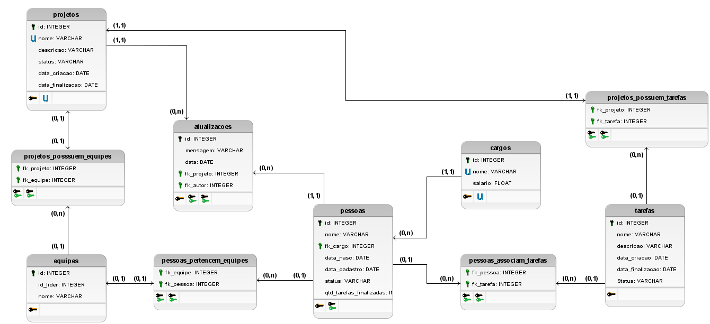

<div align="center" display="flex">
  
  <h1 align="center">API com Node.js e PostgreSQL</h1>
</div>


<p>Disponível em: https://github.com/VinicciusSantos/API-Nodejs-Postgres</p>

# Desenvolvedores
<ul>
  <li><a href="https://github.com/larissacard">Larissa Cardoso</a></li>
  <li><a href="https://github.com/Lucassec1">Lucas Emanuel</a></li>
  <li><a href="https://github.com/VinicciusSantos">Vinicius Guedes</a></li>
</ul>

# Menu
* [Sobre o Sistema](#sobre-o-sistema)
* [Funcionalidades](#funcionalidades)
* [Projetos](#projetos)
    * [Exibir Todos os Projetos](#exibir-todos-os-projetos)
    * [Exibir Projeto Específico](#exibir-projeto-especifico)
    * [Exibir Projeto Específico](#exibir-projeto-especifico)
    * [Exibir Pessoas de um Projeto](#exibir-pessoas-de-um-projeto)
    * [Exibir Tarefas de um Projeto](#exibir-tarefas-de-um-projeto)
    * [Exibir Equipes de um Projeto](#exibir-equipes-de-um-projeto)
    * [Exibir Status dos Projetos](#exibir-status-dos-projetos)
    * [Exibir Projetos com um Status Específico](#exibir-projetos-com-um-status-especifico)
    * [Cadastrar Projeto](#cadastrar-projeto)
    * [Editar Projeto](#editar-projeto)
    * [Deletar Projeto](#deletar-projeto)
* [Equipes](#equipes)
    * [Exibir Todas as Equipes](#exibir-todas-as-equipes)
    * [Exibir Equipe Específica](#exibir-equipe-especifica)
    * [Exibir Pessoas de uma Equipe](#exibir-pessoas-de-uma-equipe)
    * [Exibir Tarefas de uma Equipe](#exibir-tarefas-de-uma-equipe)
    * [Cadastrar Equipe](#cadastrar-equipe)
    * [Editar Equipe](#editar-equipe)
    * [Deletar Equipe](#deletar-equipe)
* [Pessoas](#pessoas)
    * [Exibir Todas as Pessoas](#exibir-todas-as-pessoas)
    * [Exibir Pessoas Específica](#exibir-pessoa-especifica)
    * [Exibir Tarefa de uma Pessoa](#exibir-tarefa-de-uma-pessoa)
    * [Exibir Status das Pessoas](#exibir-status-das-pessoas)
    * [Exibir Pessoas com um Status Específico](#exibir-pessoas-com-um-status-especifico)
    * [Cadastrar Pessoa](#cadastrar-pessoa)
    * [Editar Pessoa](#editar-pessoa)
    * [Deletar Pessoa](#deletar-pessoa)
* [Tarefas](#tarefas)
    * [Exibir Todas as Tarefas](#exibir-todas-as-tarefas)
    * [Exibir Tarefa Específica](#exibir-tarefa-especifica)
    * [Exibir Pessoas com a mesma Tarefa](#exibir-pessoas-com-a-mesma-tarefa)
    * [Exibir Status das Tarefas](#exibir-status-das-tarefas)
    * [Exibir Tarefas com um Status Específico](#exibir-tarefas-com-um-status-especifico)
    * [Cadastrar Tarefa](#cadastrar-tarefa)
    * [Editar Tarefa](#editar-tarefa)
    * [Deletar Tarefa](#deletar-tarefa)
* [Modelagem do Banco](#modelagem-do-banco)
* [Relacionamento dos Elementos](#relacionamento-dos-elementos)
* [Avisos](#avisos)

# Sobre o Sistema
- Um sistema para manter projetos, o sistema deve cadastrar projetos e equipes, um projeto possui uma equipe e deve ter tarefas dentro do projeto onde os membros da equipe podem se atribuir;
- Foi desenvolvido com [NodeJs](https://nodejs.org/en/), [Express](https://expressjs.com/pt-br/) e [PostgreSQL](https://www.postgresql.org);
- O Banco de Dados e a API estão hospedadas no [Heroku](https://www.heroku.com).


# Funcionalidades

- [x] Manter Equipe
- [x] Manter Projeto
- [x] Associar Equipe a projeto
- [x] Criar tarefa no projeto
- [x] Atribuir tarefa 


#  Projetos
<p>- Cada Projeto possui um ID e um Nome.<p>
<p>- Em um projeto, podemos ter várias equipes trabalhando</p>

## Exibir Todos os Projetos
<p>- Usando o método GET podemos acessar o seguinte endereço:</p>

```
https://api-brisa-nodejs-postgresql.herokuapp.com/projetos
```

## Exibir Projeto Especifico
<p>- Para Buscar algum elemento individualmente, precisamos usar o ID dele.</p>
<p>- Usando o método GET podemos acessar o seguinte endereço:</p>

```
https://api-brisa-nodejs-postgresql.herokuapp.com/projetos/:id
```

## Exibir Pessoas de um Projeto
<p>- Para Buscar algum elemento individualmente, precisamos usar o ID dele.</p>
<p>- Usando o método GET podemos acessar o seguinte endereço:</p>

```
https://api-brisa-nodejs-postgresql.herokuapp.com/projetos/:id/pessoas
```

## Exibir Tarefas de um Projeto
<p>- Para Buscar algum elemento individualmente, precisamos usar o ID dele.</p>
<p>- Usando o método GET podemos acessar o seguinte endereço:</p>

```
https://api-brisa-nodejs-postgresql.herokuapp.com/projetos/:id/tarefas
```

## Exibir Equipes de um Projeto
<p>- Para Buscar algum elemento individualmente, precisamos usar o ID dele.</p>
<p>- Usando o método GET podemos acessar o seguinte endereço:</p>

```
https://api-brisa-nodejs-postgresql.herokuapp.com/projetos/:id/equipes
```

## Exibir Status dos Projetos
<p>- Para Buscar algum elemento individualmente, precisamos usar o ID dele.</p>
<p>- Usando o método GET podemos acessar o seguinte endereço:</p>

```
https://api-brisa-nodejs-postgresql.herokuapp.com/projetos/status/
```

## Exibir Projetos com um Status Especifico
<p>- Para Buscar algum elemento individualmente, precisamos usar o ID dele.</p>
<p>- Usando o método GET podemos acessar o seguinte endereço:</p>

```
https://api-brisa-nodejs-postgresql.herokuapp.com/projetos/status/:status
```

## Cadastrar Projeto
<p>Um projeto tem os seguintes campos:
<ul>
  <li>pr_nome</li>
  <li>pr_descricao</li>
</ul>
<p>- Usando o método POST podemos acessar o seguinte endereço e cadastrar um elemento:</p>

```
https://api-brisa-nodejs-postgresql.herokuapp.com/projetos
```

## Editar Projeto
<p>- Para editar um projeto, precisamos usar o ID dele</p>
<p>- Usando o método PUT podemos acessar o seguinte endereço:</p>

```
https://api-brisa-nodejs-postgresql.herokuapp.com/projetos/:id
```

## Deletar Projeto
<p>- Para deletar um projeto, precisamos usar o ID dele</p>
<p>- Usando o método DELETE podemos acessar o seguinte endereço:</p>

```
https://api-brisa-nodejs-postgresql.herokuapp.com/projetos/:id
```


# Equipes
## Exibir todas as Equipes
<p>- Usando o método GET podemos acessar o seguinte endereço:</p>

```
https://api-brisa-nodejs-postgresql.herokuapp.com/equipes
```

## Exibir Equipe Especifica
<p>- Para Buscar algum elemento individualmente, precisamos usar o ID dele.</p>
<p>- Usando o método GET podemos acessar o seguinte endereço:</p>

```
https://api-brisa-nodejs-postgresql.herokuapp.com/equipes/:id
```

## Exibir Pessoas de uma Equipe
<p>- Para Buscar algum elemento individualmente, precisamos usar o ID dele.</p>
<p>- Usando o método GET podemos acessar o seguinte endereço:</p>

```
https://api-brisa-nodejs-postgresql.herokuapp.com/equipes/:id/pessoas
```

## Exibir Tarefas de uma Equipe
<p>- Para Buscar algum elemento individualmente, precisamos usar o ID dele.</p>
<p>- Usando o método GET podemos acessar o seguinte endereço:</p>

```
https://api-brisa-nodejs-postgresql.herokuapp.com/equipes/:id/tarefas
```

## Cadastrar Equipe
<p>Uma equipe tem os seguintes campos:
<ul>
  <li>eq_nome</li>
  <li>fk_lider</li>
</ul>
<p>- Usando o método POST podemos acessar o seguinte endereço e cadastrar um elemento:</p>

```
https://api-brisa-nodejs-postgresql.herokuapp.com/equipes
```

## Editar Equipe
<p>- Para editar uma equipe, precisamos usar o ID dela</p>
<p>- Usando o método PUT podemos acessar o seguinte endereço:</p>

```
https://api-brisa-nodejs-postgresql.herokuapp.com/equipes/:id
```

## Deletar Equipe
<p>- Para deletar uma Equipe, precisamos usar o ID dela</p>
<p>- Usando o método DELETE podemos acessar o seguinte endereço:</p>

```
https://api-brisa-nodejs-postgresql.herokuapp.com/equipes/:id
```

# Pessoas
## Exibir todas as Pessoas
<p>- Usando o método GET podemos acessar o seguinte endereço:</p>

```
https://api-brisa-nodejs-postgresql.herokuapp.com/pessoas
```

## Exibir Pessoa Especifica
<p>- Para Buscar algum elemento individualmente, precisamos usar o ID dele.</p>
<p>- Usando o método GET podemos acessar o seguinte endereço:</p>

```
https://api-brisa-nodejs-postgresql.herokuapp.com/pessoas/:id
```

## Exibir Tarefa de uma Pessoa
<p>- Para Buscar algum elemento individualmente, precisamos usar o ID dele.</p>
<p>- Usando o método GET podemos acessar o seguinte endereço:</p>

```
https://api-brisa-nodejs-postgresql.herokuapp.com/pessoas/:id/tarefas
```

## Exibir Status das Pessoas
<p>- Para Buscar algum elemento individualmente, precisamos usar o ID dele.</p>
<p>- Usando o método GET podemos acessar o seguinte endereço:</p>

```
https://api-brisa-nodejs-postgresql.herokuapp.com/pessoas/status/
```

## Exibir Pessoas com um Status Especifico
<p>- Para Buscar algum elemento individualmente, precisamos usar o ID dele.</p>
<p>- Usando o método GET podemos acessar o seguinte endereço:</p>

```
https://api-brisa-nodejs-postgresql.herokuapp.com/pessoas/status/:status
```

## Cadastrar Pessoa
<p>Uma Pessoa tem os seguintes campos:
<ul>
  <li>pe_nome</li>
  <li>pe_fk_cargo</li>
  <li>pe_data_nasc</li>
</ul>
<p>- Usando o método POST podemos acessar o seguinte endereço e cadastrar um elemento:</p>

```
https://api-brisa-nodejs-postgresql.herokuapp.com/pessoas
```

## Editar Pessoa
<p>- Para editar uma pessoa, precisamos usar o ID dela</p>
<p>- Usando o método PUT podemos acessar o seguinte endereço:</p>

```
https://api-brisa-nodejs-postgresql.herokuapp.com/pessoas/:id
```

<h2>Deletar Pessoa</h2>
<p>- Para deletar uma pessoa, precisamos usar o ID dela</p>
<p>- Usando o método DELETE podemos acessar o seguinte endereço:</p>

```
https://api-brisa-nodejs-postgresql.herokuapp.com/pessoas/:id
```

# Tarefas
## Exibir todas as Tarefas
<p>- Usando o método GET podemos acessar o seguinte endereço:</p>

```
https://api-brisa-nodejs-postgresql.herokuapp.com/tarefas
```

## Exibir Tarefa Especifica
<p>- Para Buscar algum elemento individualmente, precisamos usar o ID dele.</p>
<p>- Usando o método GET podemos acessar o seguinte endereço:</p>

```
https://api-brisa-nodejs-postgresql.herokuapp.com/tarefas/:id
```

## Exibir Pessoas com a mesma Tarefa
<p>- Para Buscar algum elemento individualmente, precisamos usar o ID dele.</p>
<p>- Usando o método GET podemos acessar o seguinte endereço:</p>

```
https://api-brisa-nodejs-postgresql.herokuapp.com/tarefas/:id/pessoas
```

## Exibir Status das Tarefas
<p>- Para Buscar algum elemento individualmente, precisamos usar o ID dele.</p>
<p>- Usando o método GET podemos acessar o seguinte endereço:</p>

```
https://api-brisa-nodejs-postgresql.herokuapp.com/tarefas/status/
```

## Exibir Tarefas com um Status Especifico
<p>- Para Buscar algum elemento individualmente, precisamos usar o ID dele.</p>
<p>- Usando o método GET podemos acessar o seguinte endereço:</p>

```
https://api-brisa-nodejs-postgresql.herokuapp.com/pessoas/tarefas/:status
```

## Cadastrar Tarefa
<p>Uma Tarefa tem os seguintes campos:
<ul>
  <li>tr_nome</li>
  <li>tr_descricao</li>
</ul>
<p>- Usando o método POST podemos acessar o seguinte endereço e cadastrar um elemento:</p>

```
https://api-brisa-nodejs-postgresql.herokuapp.com/tarefas
```

## Editar Tarefa
<p>- Para editar uma Tarefa, precisamos usar o ID dela</p>
<p>- Usando o método PUT podemos acessar o seguinte endereço:</p>

```
https://api-brisa-nodejs-postgresql.herokuapp.com/tarefas/:id
```

## Deletar Tarefa
<p>- Para deletar uma tarefa, precisamos usar o ID dela</p>
<p>- Usando o método DELETE podemos acessar o seguinte endereço:</p>

```
https://api-brisa-nodejs-postgresql.herokuapp.com/tarefas/:id
```

<br>

# Modelagem do Banco

<div align="center">
  
</div>

# Relacionamento dos Elementos

<p>Sabendo da estrutura dos elementos, podemos chegar às seguintes conclusões:</p>
<ul>
  <li>Várias pessoas podem ter a mesma tarefa, e uma pessoa pode ter várias tarefas</li>
  <li>Uma equipe pode ter várias pessoas, e uma pessoa pode estar em várias equipes</li>
  <li>Um Projeto pode ter várias equipes, e uma equipe estar em vários projeto</li>
  <li>Dentro de uma equipe, as pessoas podem ter tarefas diferentes</li>
</ul>

# Avisos
  - Caso seja digitado um ID inexistente, será retornado "Id não encontrado";
  - O tratamento de erros ainda está em andamento.
  - O Arquivo "insomnia_data.json" possui um ambiente do [Insomnia](https://insomnia.rest) com todas as rotas
